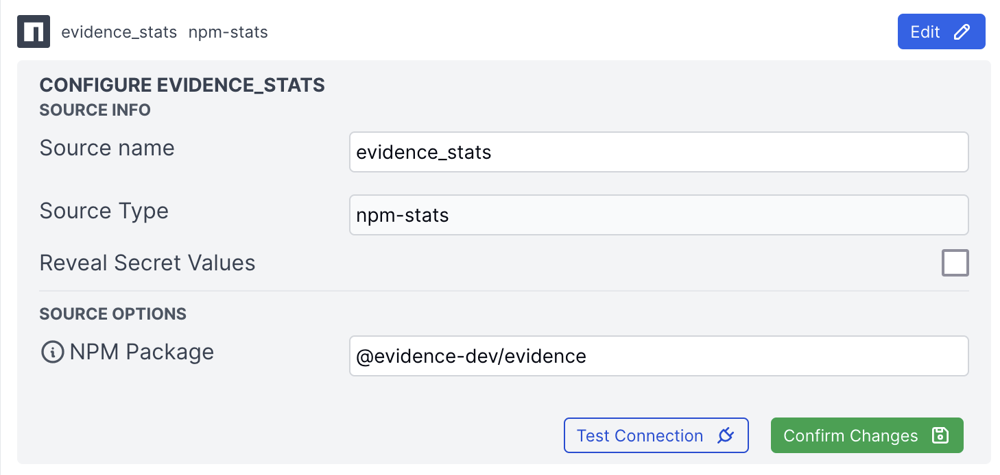

# Evidence NPM Stats Datasource

This package makes npm download statistics available as an Evidence datasource.


Specify a package that you want download stats for and this datasource will return daily downloads.

## Schema

### Tables

| Table Name | Description |
| ---------- | ----------- |
| last_day | Daily downloads for the last day |
| last_week | Daily downloads for the last week |
| last_month | Daily downloads for the last month |
| last_year | Daily downloads for the last year |
| max_range | Daily downloads for max range (currently 550 days) |


### Columns

Each table has the same columns:

| Column Name | Type | Description |
| ----------- | ---- | ----------- |
| downloads | number | The number of downloads for that day |
| day | date | The date of the downloads |


## Installing

1. Install the package

```bash
npm install evidence-connector-npm-stats
```

2. Add the datasource to your evidence.plugins.yaml

```json
datasources:
  "evidence-connector-npm-stats": { }
```

3. Start the development server, navigate to localhost:3000/settings and add a new datasource. You should see "npm-stats" as an option.

4. Add the package name you want to track to the datasource settings.




## TODO: [Recommended] Write Unit Tests

This template comes with [`vitest`](https://vitest.dev/) pre-installed. If you've used [jest](https://jestjs.io/), vitest implements a very similar API.

Tests have been stubbed in [`index.spec.js`](./datasource/src/index.spec.js), and can be run with `npm run test`

Typescript has also been included with a basic configuration, and your types can be checked with `npm run check`

